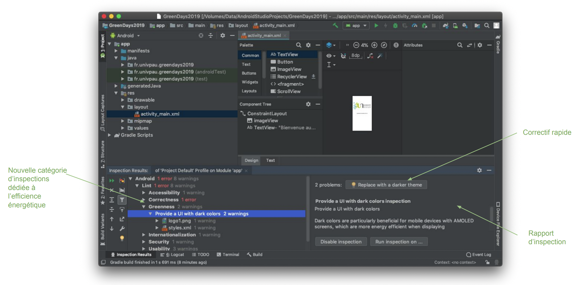

Here is an extension for Android Studio to help writing greener code. I wrote it in 2019 and now make it publicly available. It implements 12 checks and some quick fix thereof, based on a fast-evolving [catalog of android-specific energy code smells](https://olegoaer.perso.univ-pau.fr/android-energy-smells/) (expressed in Java but works for Kotlin).

This proof of concept has evolved into [ecoCode Mobile](https://github.com/cnumr/ecoCode/tree/main/src/android-plugin), based on SonarQube. Feel free to take a look at this new exciting project 🔥

# 💾 Installation
* Download [greenchecks.jar](./assets/greenchecks.jar) (tested for Android Lint version 26.3.2)
* Move the file into your `~/.android/lint` directory. Create it if needed
* Restart Android Studio

# 🔍 Inspections
* Open any Android project
* Select `Analyse>Inspect code` from the top menu
* Select your app Module only
* Focus on the new *Greenness* category reporting



# ✍️ Contribute

In 2019 I waded in the undocumented waters of the Android Lint API but since 2021, there exist a documentation: http://googlesamples.github.io/android-custom-lint-rules/api-guide.html

For more information about recent changes in Android Lint and how to write custom Lint rules, please see the following links:
* Google group lint-dev: https://groups.google.com/g/lint-dev
* KotlinConf on youtube: https://youtu.be/p8yX5-lPS6o

# 🔗 How to cite this work?
```bibtex
@inproceedings{legoaer:hal-03252141,
  TITLE = {{Enforcing Green Code with Android Lint}},
  AUTHOR = {Le Goaer, Olivier},
  BOOKTITLE = {{ASEW '20: 35th IEEE/ACM International Conference on Automated Software Engineering Workshops}},
  ADDRESS = {Melbourne, Australia},
  PUBLISHER = {{ACM}},
  PAGES = {85-90},
  YEAR = {2021},
  MONTH = Sep,
  DOI = {10.1145/3417113.3422188},
  KEYWORDS = {green ; battery ; energy ; bugs ; lint ; smells ; Android},
}
```
